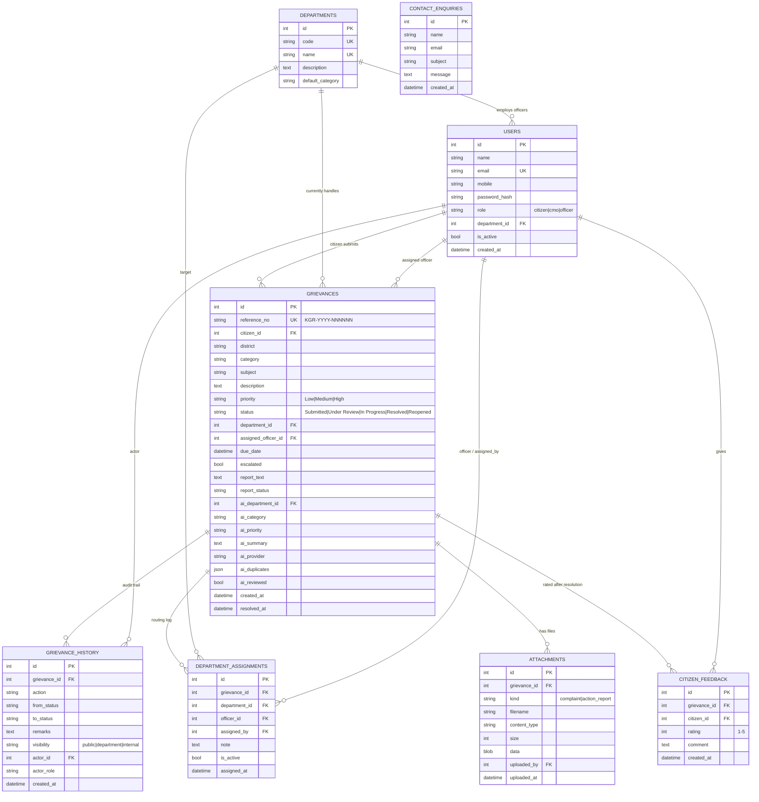

# Database ER Diagram

```mermaid
erDiagram
    DEPARTMENTS ||--o{ USERS : "employs officers"
    USERS ||--o{ GRIEVANCES : "citizen submits"
    DEPARTMENTS ||--o{ GRIEVANCES : "currently handles"
    USERS ||--o{ GRIEVANCES : "assigned officer"
    GRIEVANCES ||--o{ GRIEVANCE_HISTORY : "audit trail"
    USERS ||--o{ GRIEVANCE_HISTORY : "actor"
    GRIEVANCES ||--o{ DEPARTMENT_ASSIGNMENTS : "routing log"
    DEPARTMENTS ||--o{ DEPARTMENT_ASSIGNMENTS : "target"
    USERS ||--o{ DEPARTMENT_ASSIGNMENTS : "officer / assigned_by"
    GRIEVANCES ||--o{ ATTACHMENTS : "has files"
    GRIEVANCES ||--o{ CITIZEN_FEEDBACK : "rated after resolution"
    USERS ||--o{ CITIZEN_FEEDBACK : "gives"

    DEPARTMENTS {
        int id PK
        string code UK
        string name UK
        text description
        string default_category
    }
    USERS {
        int id PK
        string name
        string email UK
        string mobile
        string password_hash
        string role "citizen|cmo|officer"
        int department_id FK
        bool is_active
        datetime created_at
    }
    GRIEVANCES {
        int id PK
        string reference_no UK "KGR-YYYY-NNNNNN"
        int citizen_id FK
        string district
        string category
        string subject
        text description
        string priority "Low|Medium|High"
        string status "Submitted|Under Review|In Progress|Resolved|Reopened"
        int department_id FK
        int assigned_officer_id FK
        datetime due_date
        bool escalated
        text report_text
        string report_status
        int ai_department_id FK
        string ai_category
        string ai_priority
        text ai_summary
        string ai_provider
        json ai_duplicates
        bool ai_reviewed
        datetime created_at
        datetime resolved_at
    }
    GRIEVANCE_HISTORY {
        int id PK
        int grievance_id FK
        string action
        string from_status
        string to_status
        text remarks
        string visibility "public|department|internal"
        int actor_id FK
        string actor_role
        datetime created_at
    }
    DEPARTMENT_ASSIGNMENTS {
        int id PK
        int grievance_id FK
        int department_id FK
        int officer_id FK
        int assigned_by FK
        text note
        bool is_active
        datetime assigned_at
    }
    ATTACHMENTS {
        int id PK
        int grievance_id FK
        string kind "complaint|action_report"
        string filename
        string content_type
        int size
        blob data
        int uploaded_by FK
        datetime uploaded_at
    }
    CITIZEN_FEEDBACK {
        int id PK
        int grievance_id FK
        int citizen_id FK
        int rating "1-5"
        text comment
        datetime created_at
    }
    CONTACT_ENQUIRIES {
        int id PK
        string name
        string email
        string subject
        text message
        datetime created_at
    }
```
