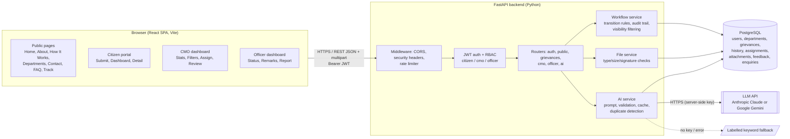
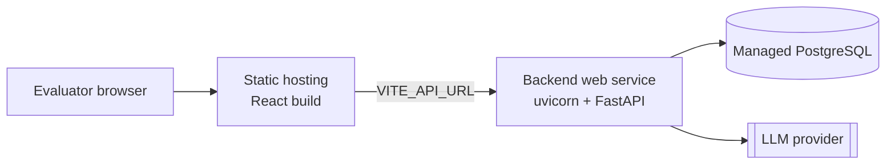

# System Architecture Diagram

```mermaid
flowchart LR
    subgraph Browser["Browser (React SPA, Vite)"]
        PUB[Public pages<br/>Home, About, How It Works,<br/>Departments, Contact, FAQ, Track]
        CIT[Citizen portal<br/>Submit, Dashboard, Detail]
        CMO[CMO dashboard<br/>Stats, Filters, Assign, Review]
        OFF[Officer dashboard<br/>Status, Remarks, Report]
    end

    subgraph API["FastAPI backend (Python)"]
        MW[Middleware: CORS, security headers,<br/>rate limiter]
        AUTH[JWT auth + RBAC<br/>citizen / cmo / officer]
        R[Routers: auth, public, grievances,<br/>cmo, officer, ai]
        WF[Workflow service<br/>transition rules, audit trail,<br/>visibility filtering]
        FILES[File service<br/>type/size/signature checks]
        AIS[AI service<br/>prompt, validation, cache,<br/>duplicate detection]
    end

    DB[(PostgreSQL<br/>users, departments, grievances,<br/>history, assignments,<br/>attachments, feedback, enquiries)]
    LLM[[LLM API<br/>Anthropic Claude or Google Gemini]]
    FB[/Labelled keyword fallback/]

    Browser -- "HTTPS / REST JSON + multipart<br/>Bearer JWT" --> MW --> AUTH --> R
    R --> WF --> DB
    R --> FILES --> DB
    R --> AIS
    AIS -- "HTTPS (server-side key)" --> LLM
    AIS -. "no key / error" .-> FB
    AIS --> DB
```

## Deployment view

```mermaid
flowchart LR
    U[Evaluator browser] --> FE[Static hosting<br/>React build]
    FE -->|VITE_API_URL| BE[Backend web service<br/>uvicorn + FastAPI]
    BE --> PG[(Managed PostgreSQL)]
    BE --> LLM[[LLM provider]]
```
